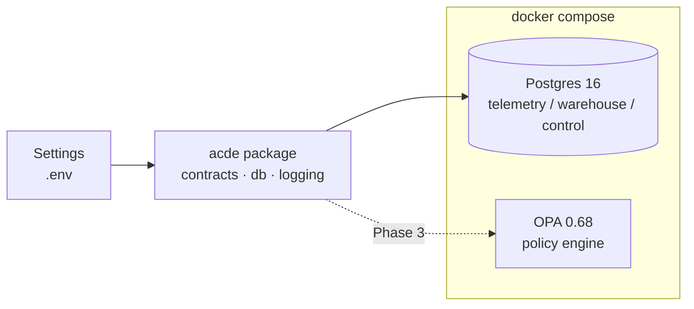

# ACDE — Agentic Cloud Data Engineering

A research-grade, reproducible replication of *"Governing Cloud Data Pipelines with
Agentic AI"* (arXiv:2512.23737): four bounded AI agents (**monitoring**, **optimization**,
**schema**, **recovery**) observe pipeline telemetry, reason via LLM, and **propose**
operational actions that an OPA policy gate validates **before** execution. Agents never
execute anything directly and never generate code. The system is benchmarked against a
static-orchestration baseline with a deterministic failure-injection harness, a seeded
experiment matrix, and a statistical analysis pipeline (paired tests, corrections, effect
sizes, CIs).

## Architecture (Phase 0 slice)



Later phases add Airflow 2.10 + Redpanda (data plane), telemetry collectors, the agent
control loop, the chaos harness, and the experiment runner. See the phase table below.

## Quickstart

Prereqs: [uv](https://docs.astral.sh/uv/), Docker Desktop (Compose v2), GNU make.

```bash
cp .env.example .env        # defaults work for local dev; add ANTHROPIC_API_KEY for live runs
uv sync                     # create venv from committed uv.lock
make up                     # full stack: postgres, opa, redpanda, airflow (builds the image)
make test-unit              # unit tests, MOCK_LLM=1, zero API calls, coverage >= 80%
make seed                   # generate seeded datasets + migrate the DB
make test-integration       # batch DAG + streaming session + stack smoke
make down
```

`make up-core` starts only postgres + OPA (fast) when you don't need the data plane.
Postgres is published on host port **5433** (so it coexists with a local Postgres on 5432).
`MOCK_LLM=1` is the default everywhere (tests, CI, local runs); live LLM runs are opt-in.

### Data plane

```bash
make seed     # seeded TPC-DS + open-gov CSVs → data/, then apply init SQL
make stream   # publish a seeded burst, then run the consumer for one 60s session
```

- **Batch (Airflow, localhost:8080):** trigger `tpcds_ingest` → `validate → transform →
  materialize` writes a new **versioned partition** (`warehouse.partition_versions`); rollback
  is a pointer flip.
- **Streaming (Redpanda):** the producer emits seeded bursty events; the consumer aggregates
  them into 60s tumbling windows (`warehouse.stream_aggregates`, with `event_ts` /
  `materialized_ts`) over an async worker pool sized **live** from
  `control.desired_state['streaming.workers']` (1–8).

### Telemetry & cost

```bash
DURATION=180 make telemetry   # collect Airflow + docker stats for 3 min, then aggregate cost
make cost                     # (re)aggregate the cost ledger from resource_usage
```

The collector fills `telemetry.task_runs` (Airflow REST), `telemetry.resource_usage`
(`docker stats` + logical `streaming`/`batch` resource units), and `telemetry.pipeline_metrics`
(freshness). `cost.py` writes `telemetry.cost_ledger` per the disclosed model above
(`compute_unit_seconds × 0.05 + storage_gb_hours × 0.01`). All rows are tagged `experiment_run`.

### Policy plane

Every agent action is a `ProposedAction` that the **gate** evaluates against OPA before the
**executor** touches anything:

```
ProposedAction ──▶ gate.build_context() ──▶ OPA data.acde.policy.decision ──▶ PolicyDecision
                                                                                │
                        allowed ─▶ executor side effect (rollback / scale / retry / quarantine …)
                        escalate ─▶ telemetry.manual_interventions ─▶ human simulator resolves
```

- Four Rego policies (`infra/opa/policies/`): `cost_budget`, `recovery_approval`,
  `schema_compat`, `rate_limit`, aggregated by `main.rego`. Run their tests with `make opa-test`
  (20 cases). OPA runs with `--watch`, so editing a policy hot-reloads it.
- The gate **fails safe** — if OPA is unreachable it escalates rather than allowing.
- The human simulator (`acde.human.simulator`) resolves escalations after a seeded
  lognormal(360 s, σ0.5) delay; run it with
  `python -m acde.human.simulator --duration 600 --experiment-run <run>`.

## Cost model (disclosed)

The paper does not define its cost model. Ours (see DEVIATIONS.md D-006):

```
cost_units = compute_unit_seconds × 0.05 + storage_gb_hours × 0.01
compute_unit_seconds = Σ over components: (active workers or pool slots in use) × wall seconds
```

## Repository map

Key entry points — full tree in the project spec:

- `src/acde/contracts/` — pydantic contracts (§5.2): `ProposedAction`, `PolicyDecision`, …
- `src/acde/config.py` — every knob, from env/`.env` only
- `infra/postgres/init/` — idempotent DDL: `telemetry`, `warehouse`, `control` schemas
- `infra/opa/policies/` — Rego policies (Phase 3)
- `tests/unit` (no docker) · `tests/integration` (needs `make up`)
- `DEVIATIONS.md` — every assumption vs. the paper (research artifact)

## Phase status

| Phase | Scope | Status |
|---|---|---|
| 0 | Scaffold, contracts, postgres+OPA, CI | ✅ verified |
| 1 | Data plane: Airflow, Redpanda, datasets | ✅ verified |
| 2 | Telemetry, cost ledger, freshness | ✅ verified |
| 3 | Policy plane (OPA) & executor | ✅ verified |
| 4 | Failure-injection harness | ⬜ |
| 5 | Agents & LLM layer | ⬜ |
| 6 | Control-loop orchestrator | ⬜ |
| 7 | Baseline & experiment runner | ⬜ |
| 8 | Analysis, figures, report | ⬜ |
| 9 | Hardening & reproducibility package | ⬜ |

## Reproduction

The full reproduction guide (clone → every figure) lands in Phase 9. Every stochastic
component is seeded (`run_seed = sha256(f"{config}:{scenario}:{replicate}") % 2**32`);
all experiment metrics are reconstructable from the `telemetry` schema and JSON logs.
