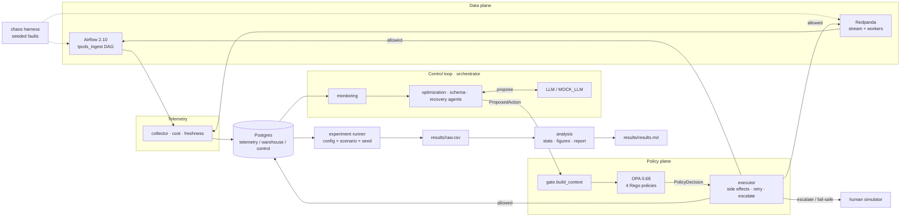

# ACDE — Agentic Cloud Data Engineering

A research-grade, reproducible replication of *"Governing Cloud Data Pipelines with
Agentic AI"* (arXiv:2512.23737): four bounded AI agents (**monitoring**, **optimization**,
**schema**, **recovery**) observe pipeline telemetry, reason via LLM, and **propose**
operational actions that an OPA policy gate validates **before** execution. Agents never
execute anything directly and never generate code. The system is benchmarked against a
static-orchestration baseline with a deterministic failure-injection harness, a seeded
experiment matrix, and a statistical analysis pipeline (paired tests, corrections, effect
sizes, CIs).

## Architecture



Agents only ever emit a pydantic `ProposedAction`; the OPA gate decides; the executor is the sole
component with side effects (and it retries then escalates rather than crash — see **Fault
tolerance**). Everything durable lives in Postgres, so the loop is stateless and resumable.

## Quickstart

Prereqs: [uv](https://docs.astral.sh/uv/), Docker Desktop (Compose v2), GNU make.

```bash
cp .env.example .env        # defaults work for local dev; add ANTHROPIC_API_KEY for live runs
uv sync                     # create venv from committed uv.lock
make up                     # full stack: postgres, opa, redpanda, airflow (builds the image)
make test-unit              # unit tests, MOCK_LLM=1, zero API calls, coverage >= 80%
make seed                   # generate seeded datasets + migrate the DB
make test-integration       # batch DAG + streaming session + stack smoke
make down
```

`make up-core` starts only postgres + OPA (fast) when you don't need the data plane.
Postgres is published on host port **5433** (so it coexists with a local Postgres on 5432).
`MOCK_LLM=1` is the default everywhere (tests, CI, local runs); live LLM runs are opt-in.

### Data plane

```bash
make seed     # seeded TPC-DS + open-gov CSVs → data/, then apply init SQL
make stream   # publish a seeded burst, then run the consumer for one 60s session
```

- **Batch (Airflow, localhost:8080):** trigger `tpcds_ingest` → `validate → transform →
  materialize` writes a new **versioned partition** (`warehouse.partition_versions`); rollback
  is a pointer flip.
- **Streaming (Redpanda):** the producer emits seeded bursty events; the consumer aggregates
  them into 60s tumbling windows (`warehouse.stream_aggregates`, with `event_ts` /
  `materialized_ts`) over an async worker pool sized **live** from
  `control.desired_state['streaming.workers']` (1–8).

### Telemetry & cost

```bash
DURATION=180 make telemetry   # collect Airflow + docker stats for 3 min, then aggregate cost
make cost                     # (re)aggregate the cost ledger from resource_usage
```

The collector fills `telemetry.task_runs` (Airflow REST), `telemetry.resource_usage`
(`docker stats` + logical `streaming`/`batch` resource units), and `telemetry.pipeline_metrics`
(freshness). `cost.py` writes `telemetry.cost_ledger` per the disclosed model above
(`compute_unit_seconds × 0.05 + storage_gb_hours × 0.01`). All rows are tagged `experiment_run`.

### Policy plane

Every agent action is a `ProposedAction` that the **gate** evaluates against OPA before the
**executor** touches anything:

```
ProposedAction ──▶ gate.build_context() ──▶ OPA data.acde.policy.decision ──▶ PolicyDecision
                                                                                │
                        allowed ─▶ executor side effect (rollback / scale / retry / quarantine …)
                        escalate ─▶ telemetry.manual_interventions ─▶ human simulator resolves
```

- Four Rego policies (`infra/opa/policies/`): `cost_budget`, `recovery_approval`,
  `schema_compat`, `rate_limit`, aggregated by `main.rego`. Run their tests with `make opa-test`
  (20 cases). OPA runs with `--watch`, so editing a policy hot-reloads it.
- The gate **fails safe** — if OPA is unreachable it escalates rather than allowing.
- The executor **retries then escalates** — an Airflow-REST side effect that fails is retried with
  bounded backoff and, if it still fails, degrades to a human escalation (see **Fault tolerance**).
- The human simulator (`acde.human.simulator`) resolves escalations after a seeded
  lognormal(360 s, σ0.5) delay; run it with
  `python -m acde.human.simulator --duration 600 --experiment-run <run>`.

### Agents

Four bounded agents (`acde.agents`) run **observe → detect → reason → propose → gate →
execute**, logging every action to `telemetry.agent_actions`. Detection is statistical
(z-score + thresholds); the LLM only triages/proposes a `ProposedAction` (never executes or
emits code). Monitoring stamps `detected_ts`, recovery stamps `resolved_ts` — so MTTR is
`resolved_ts − detected_ts`.

```bash
make chaos-schema_drift            # inject a fault
EXPERIMENT_RUN=demo make agents    # one cycle of all four agents (MOCK_LLM=1)
# → schema agent quarantines the drifted partition; unaffected pipelines continue
```

`MOCK_LLM=1` (the default) serves deterministic proposals with zero API calls. The live path is
built but opt-in: `EXPERIMENT_RUN=smoke make agents-live-smoke` makes one real call, routed
monitoring→fast model / others→reasoning model, bounded by the 60-call / 150k-token per-run caps.
The live provider is chosen by `LLM_PROVIDER`: **`anthropic`** (default, needs `ANTHROPIC_API_KEY`,
Sonnet/Haiku), **`gemini`** (D-056, needs `GEMINI_API_KEY`, `gemini-2.5-pro`/`gemini-2.5-flash`,
overridable via `GEMINI_MODEL_*`), or **`openai_compatible`** (D-057 — NVIDIA NIM / Groq / OpenRouter
/ z.ai via `OAI_BASE_URL` + `OAI_API_KEY` + `OAI_MODEL_*`; defaults to NVIDIA NIM's `z-ai/glm-5.2`).
The `openai_compatible` provider uses a larger `OAI_MAX_TOKENS_PER_CALL` so "thinking" models can
reach the JSON. All providers run at temperature 0 and degrade to `no_action` on failure; `MOCK_LLM=1`
remains the default everywhere including CI.

### Orchestrator (control loop)

`acde.orchestrator.loop.ControlLoop` runs the agents continuously: monitoring every
`MONITORING_INTERVAL_S`, the reactive agents (schema → recovery → optimization) only when faults
are open. A **Postgres advisory lock per target** guarantees no two agents act on the same target
at once, and the act order makes **recovery outrank optimization** on a shared target. Which agents
run is set by the ablation config (`baseline`, `monitor_only`, `recovery_only`, …, `full`).

```bash
CONFIG=full DURATION=1200 EXPERIMENT_RUN=demo make orchestrator   # run the loop
CONFIG=full DURATION=1200 EXPERIMENT_RUN=soak make soak            # inject 2 faults + run the loop
```

The loop keeps no durable state (everything is in Postgres), so **killing and restarting it resumes
cleanly** — the basis for the resumable experiment runner in Phase 7.

### Experiments

The runner sweeps the config × scenario × seed matrix, and for each run injects the seeded fault,
lets the agents (or, for `baseline`, the simulated human) respond, and harvests the §5.4 metrics
into `results/raw.csv` (one row per metric) with a `results/manifest.jsonl` checkpoint.

```bash
make experiment-smoke   # 2 runs (the gate)          make experiment-quick   # 72 runs, ~15–25 min
make experiment-paper   # 320 runs (the publication run; launch overnight)
```

Every run is keyed by `experiment_run = "{config}__{scenario}__r{replicate}"` and isolated; the
runner **skips runs already in the manifest**, so a killed matrix resumes where it left off. The
seed policy `sha256("{config}:{scenario}:{replicate}") % 2³²` gives each cell reproducible fault
conditions. First reproduced signal (smoke, `upstream_delay`): **baseline MTTR ≈ 312 s** (human) vs
**full MTTR ≈ 0.2 s** (recovery agent). Phase 8 turns `raw.csv` into the paper's figures.

### Analysis & report

```bash
make analyze   # stats from results/raw.csv → results/analysis.json
make report    # analyze + figures + results/results.md
```

`acde.analysis` computes, per metric, per-config **median / IQR / bootstrap 95% CI** plus a paired
**baseline-vs-full Wilcoxon** test with **Holm–Bonferroni** correction and **Cliff's delta** effect
size. `figures.py` renders MTTR/cost/interventions bars with CI error bars, an MTTR CDF, and the
**ablation heatmap** (config × metric % vs baseline) to `results/figures/`. `report.py` writes
`results/results.md` — per-metric tables, embedded figures, a comparison of our full-vs-baseline
reductions to the paper's **45% / 25% / 70%** claims, and an appended `DEVIATIONS.md`.

### Chaos harness

Four seeded failure scenarios (§6) degrade the running pipelines and record
`telemetry.failure_events`:

```bash
make chaos-schema_drift        # corrupt the batch source → next DAG run fails validation
make chaos-upstream_delay      # publish a dropped + delayed stream (freshness stressor)
make chaos-resource_contention # CPU contention for the fault window (host stressor by default)
make chaos-ingress_burst       # ×5–10 rate surge to the stream
# inspect the deterministic plan without side effects:
python -m acde.chaos.injector --scenario ingress_burst --seed 42 --plan-only
```

The fault plan is a **pure seeded function** — the same seed always yields the same plan
(`run_seed = sha256(f"{config}:{scenario}:{replicate}") % 2**32`), so the experiment runner can
replay identical fault conditions across configs. `make seed` restores the source CSV after a
`schema_drift`.

## Cost model (disclosed)

The paper does not define its cost model. Ours (see DEVIATIONS.md D-006):

```
cost_units = compute_unit_seconds × 0.05 + storage_gb_hours × 0.01
compute_unit_seconds = Σ over components: (active workers or pool slots in use) × wall seconds
```

## Repository map

Key entry points — full tree in the project spec:

- `src/acde/contracts/` — pydantic contracts (§5.2): `ProposedAction`, `PolicyDecision`, …
- `src/acde/config.py` — every knob, from env/`.env` only
- `infra/postgres/init/` — idempotent DDL: `telemetry`, `warehouse`, `control` schemas
- `infra/opa/policies/` — Rego policies (Phase 3)
- `tests/unit` (no docker) · `tests/integration` (needs `make up`)
- `DEVIATIONS.md` — every assumption vs. the paper (research artifact)
- `DATA_LICENSES.md` — provenance & licensing of the TPC-DS and NYC TLC data sources

## Fault tolerance

Operational agents must survive a dependency outage, not crash. ACDE degrades on three failure modes
(proven by unit tests; `tests/integration/test_failure_modes.py` also stops the real OPA container):

| Dependency down | Behaviour | Where |
|---|---|---|
| **OPA** unreachable | gate fails safe → **escalate** (never allow) | `policy/gate.py` |
| **Airflow** unreachable | executor **retries with bounded backoff**, then escalates; returns an `execution_failed` outcome instead of raising | `policy/executor.py` (D-052) |
| **Postgres** transient blip | `acde.db` **retries** the statement (tenacity) and recovers | `db.py` |

In every case the agent cycle completes and, where relevant, a `telemetry.manual_interventions` row
hands the incident to the (simulated) human — the loop stays alive and resumable.

## Beyond the paper (v1.3)

ACDE goes past a faithful replica into a rigorous benchmark that also tests claims the paper asserts
without evidence. See [`REPORT.md`](REPORT.md) (what reproduces / what doesn't) and
[`docs/PAPER_MAPPING.md`](docs/PAPER_MAPPING.md) (section-by-section mapping).

- **Credible baselines** — `rule_based` + `autoscale` alongside static+human, so the comparison is
  "agents vs cheap automation," not just "agents vs a slow human" (D-058).
- **Decision-quality metric** — `decision_correct`: did the agent pick the *right* mitigation, not
  just a fast one (D-059)?
- **Cost model v2** — credits avoided over-provisioning, making the paper's cost claim testable (D-061).
- **Cross-LLM study** — `python -m acde.eval.cross_model` measures decision correctness/latency/tokens
  across models, testing the paper's "model-agnostic" claim (D-063).
- **Adversarial safety eval** — `python -m acde.eval.adversarial` injects unsafe proposals and measures
  the OPA gate's containment rate (**1.0** against real OPA) — the first stress-test of the paper's
  core safety thesis (D-062).
- **Bounded adaptation** — `agents/adaptation.py` concretizes the paper's §V adaptation claim, off by
  default for determinism (D-064).

## Phase status

| Phase | Scope | Status |
|---|---|---|
| 0 | Scaffold, contracts, postgres+OPA, CI | ✅ verified |
| 1 | Data plane: Airflow, Redpanda, datasets | ✅ verified |
| 2 | Telemetry, cost ledger, freshness | ✅ verified |
| 3 | Policy plane (OPA) & executor | ✅ verified |
| 4 | Failure-injection harness | ✅ verified |
| 5 | Agents & LLM layer | ✅ verified |
| 6 | Control-loop orchestrator | ✅ verified |
| 7 | Baseline & experiment runner | ✅ verified |
| 8 | Analysis, figures, report | ✅ verified |
| 9 | Hardening & reproducibility package | ✅ verified |

## Reproduction

From a clean clone to the paper's figures. Every stochastic component is seeded
(`run_seed = sha256(f"{config}:{scenario}:{replicate}") % 2**32`) and `MOCK_LLM=1` is the default, so
the pipeline is deterministic and needs zero API calls.

```bash
git clone <repo> && cd cloudagent
uv sync                       # venv from the committed uv.lock
cp .env.example .env          # defaults work; add ANTHROPIC_API_KEY only for optional live runs
make lint && make test-unit   # gate: ruff+mypy clean, ~290 unit tests, coverage ≥ 80%

make up                       # full stack: postgres, opa, redpanda, airflow
make seed                     # seeded TPC-DS + open-gov data, then migrate the DB
make test-integration         # optional: stack smoke, agents e2e, failure modes

make experiment-paper         # the publication matrix (320 runs) → results/raw.csv (launch overnight)
make report                   # analyze + figures → results/results.md + results/figures/*.png
make down
```

Open `results/results.md` for the per-metric tables, the ablation heatmap, and the comparison of our
full-vs-baseline reductions to the paper's **45% / 25% / 70%** claims. All experiment metrics are
reconstructable from the `telemetry` schema and the JSON logs; data provenance/licensing is in
`DATA_LICENSES.md`. Prefer a fast smoke first: `make experiment-quick` (72 runs, ~15–25 min) then
`make report`.
