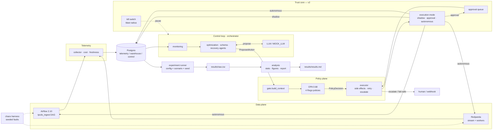

# ACDE — Agentic Cloud Data Engineering

**Policy-bounded agentic governance for cloud data pipelines.**

[](LICENSE)
[](https://github.com/bodapatisaikrishna/agentic-cloud-pipeline-governance/actions/workflows/ci.yml)
[](pyproject.toml)
[](https://github.com/bodapatisaikrishna/agentic-cloud-pipeline-governance/tags)
[](tests/unit)
[](docs/SECURITY.md)

Four bounded AI agents (**monitoring**, **optimization**, **schema**, **recovery**) observe pipeline
telemetry, reason via an LLM, and **propose** operational actions. An **OPA policy gate validates
every proposal before execution** — agents never touch a pipeline directly and never generate code.
Safety comes from the architecture, not the model.

ACDE is both:

-  **A production tool** (v2.0) that companies deploy to govern their own Airflow pipelines, with
  graduated autonomy, an approval workflow, a kill switch, and an operator API.
-  **A reproducible research artifact** (v1.3) that replicates and rigorously extends
  *["Governing Cloud Data Pipelines with Agentic AI"](https://arxiv.org/abs/2512.23737)*
  (arXiv:2512.23737).

---

## Table of contents

- [Why ACDE](#why-acde)
- [Production quickstart](#production-quickstart-deploy-against-your-own-airflow)
- [Research quickstart](#research-quickstart-reproduce-the-paper)
- [Architecture](#architecture)
- [Documentation](#documentation)
- [Deep dive](#deep-dive)
  - [Data plane](#data-plane) · [Telemetry & cost](#telemetry--cost) · [Policy plane](#policy-plane) ·
    [Agents](#agents) · [Orchestrator](#orchestrator-control-loop) · [Experiments](#experiments) ·
    [Analysis & report](#analysis--report) · [Chaos harness](#chaos-harness)
- [Fault tolerance](#fault-tolerance)
- [Beyond the paper](#beyond-the-paper-v13)
- [Repository map](#repository-map)
- [Phase status](#phase-status)
- [Reproduction](#reproduction)
- [License & citation](#license--citation)

---

## Why ACDE

Most tools in this space pick one of two extremes: **observability platforms detect** problems and
stop there, or **generic AIOps automation acts** on infrastructure with no policy boundary and no
audit trail. ACDE is neither — it's a **governed control plane**:

| | Observability tools | Opaque AIOps | **ACDE** |
|---|---|---|---|
| Detects anomalies | ✅ | ✅ | ✅ |
| Proposes a fix | ❌ | ✅ | ✅ |
| Every action validated by declarative policy first | — | ❌ | ✅ (OPA, fail-safe) |
| Graduated autonomy (shadow → approval → autonomous) | — | ❌ | ✅ |
| Full audit trail of proposal + verdict + outcome | partial | rarely | ✅ |
| Attaches to *your* orchestrator, not a bundled one | — | varies | ✅ (connector boundary) |
| Adversarially tested containment | — | — | ✅ measured **1.0** |
| Rehearsal on your own pipelines with an ROI report | ❌ | ❌ | ✅ `acde gameday` / `acde report` |

Every claim above is backed by code in this repo, not marketing copy — see
[Beyond the paper](#beyond-the-paper-v13) and [`docs/SECURITY.md`](docs/SECURITY.md).

## Production quickstart (deploy against your own Airflow)

Graduated autonomy (**shadow → approval → autonomous**), a connector that attaches to *your*
orchestrator, an operator API + `acde` CLI, a kill switch, and blast-radius caps.

```bash
cp .env.prod.example .env.prod   # set API_KEY, POSTGRES_PASSWORD, AIRFLOW_*, LLM key
docker compose -f deploy/docker-compose.prod.yml up -d --build
acde doctor                      # validate the deployment; then `acde run` (shadow by default)
```

ACDE ships **shadow-mode by default** in production — it logs what it would do and never touches
your pipeline until you graduate it. See [`docs/OPERATIONS.md`](docs/OPERATIONS.md) (deploy, trust
ladder, kill switch), [`docs/CONNECTING.md`](docs/CONNECTING.md) (Airflow setup),
[`docs/POLICY_AUTHORING.md`](docs/POLICY_AUTHORING.md) (Rego policies), and
[`docs/SECURITY.md`](docs/SECURITY.md) (threat model).

## Research quickstart (reproduce the paper)

```bash
git clone https://github.com/bodapatisaikrishna/agentic-cloud-pipeline-governance.git
cd agentic-cloud-pipeline-governance
uv sync --extra research      # venv incl. the benchmark/chaos/analysis extras
cp .env.example .env          # defaults work; MOCK_LLM=1 is the default everywhere
make lint && make test-unit   # gate: ruff+mypy clean, 360 unit tests, coverage ≥ 80%
make up && make seed          # full stack (postgres, opa, redpanda, airflow) + seeded data
make experiment-quick         # 96-run matrix (8 configs × 4 scenarios × N=3)
make report                   # → results/results.md + results/figures/*.png
```

The `acde[research]` extra installs the benchmark, chaos harness, and analysis pipeline (pandas /
scipy / matplotlib) on top of the lean production core. See [`REPORT.md`](REPORT.md) for what
reproduces from the paper and what we extend beyond it.

## Architecture



Agents only ever emit a pydantic `ProposedAction`; the OPA gate decides; the executor is the sole
component with side effects, and in production it routes through the execution mode (shadow queues
nothing, approval queues for a human, autonomous executes) before ever reaching a real system — see
[Fault tolerance](#fault-tolerance). Everything durable lives in Postgres, so the loop is stateless
and resumable.

## Documentation

| Doc | What it covers |
|---|---|
| [`docs/OPERATIONS.md`](docs/OPERATIONS.md) | Deploying, the trust ladder, kill switch, observability, upgrades |
| [`docs/CONNECTING.md`](docs/CONNECTING.md) | Attaching ACDE to your Airflow (least-privilege service account) |
| [`docs/POLICY_AUTHORING.md`](docs/POLICY_AUTHORING.md) | Writing/testing OPA policies, shipped policy packs |
| [`docs/SECURITY.md`](docs/SECURITY.md) | Threat model, design guarantees, operator responsibilities |
| [`docs/PAPER_MAPPING.md`](docs/PAPER_MAPPING.md) | Paper section → implementation → measured result |
| [`REPORT.md`](REPORT.md) | What reproduces from the paper, what doesn't, and why |
| [`DEVIATIONS.md`](DEVIATIONS.md) | Every design decision vs. the paper, with rationale (68 entries) |
| [`DATA_LICENSES.md`](DATA_LICENSES.md) | Provenance & licensing of the TPC-DS / NYC TLC datasets |
| [`CHANGELOG.md`](CHANGELOG.md) | Release history, v0.1 → v2.0.0 |

## Deep dive

### Data plane

```bash
make seed     # seeded TPC-DS + open-gov CSVs → data/, then apply init SQL
make stream   # publish a seeded burst, then run the consumer for one 60s session
```

- **Batch (Airflow, localhost:8080):** trigger `tpcds_ingest` → `validate → transform →
  materialize` writes a new **versioned partition** (`warehouse.partition_versions`); rollback
  is a pointer flip.
- **Streaming (Redpanda):** the producer emits seeded bursty events; the consumer aggregates
  them into 60s tumbling windows (`warehouse.stream_aggregates`, with `event_ts` /
  `materialized_ts`) over an async worker pool sized **live** from
  `control.desired_state['streaming.workers']` (1–8).

### Telemetry & cost

```bash
DURATION=180 make telemetry   # collect Airflow + docker stats for 3 min, then aggregate cost
make cost                     # (re)aggregate the cost ledger from resource_usage
```

The collector fills `telemetry.task_runs` (Airflow REST), `telemetry.resource_usage`
(`docker stats` + logical `streaming`/`batch` resource units), and `telemetry.pipeline_metrics`
(freshness). `cost.py` writes `telemetry.cost_ledger` per the disclosed model below. All rows are
tagged `experiment_run`.

### Policy plane

Every agent action is a `ProposedAction` that the **gate** evaluates against OPA before the
**executor** touches anything:

```
ProposedAction ──▶ gate.build_context() ──▶ OPA data.acde.policy.decision ──▶ PolicyDecision
                                                                                │
                        allowed ─▶ execution mode (shadow / approval / autonomous)
                        escalate ─▶ telemetry.manual_interventions ─▶ human / webhook resolves
```

- Four Rego policies (`infra/opa/policies/`): `cost_budget`, `recovery_approval`,
  `schema_compat`, `rate_limit`, aggregated by `main.rego`. Run their tests with `make opa-test`
  (20 cases). OPA runs with `--watch`, so editing a policy hot-reloads it.
- The gate **fails safe** — if OPA is unreachable it escalates rather than allowing.
- The executor **retries then escalates** — an Airflow-REST side effect that fails is retried with
  bounded backoff and, if it still fails, degrades to a human escalation (see [Fault tolerance](#fault-tolerance)).
- In production, an *allowed* action still passes through the **execution mode** (`acde_mode`):
  `shadow` logs it, `approval` queues it for a human (`acde approvals approve <id>`), `autonomous`
  executes it. High-blast-radius action types can be forced to `approval` even in autonomous mode.
- The human simulator (`acde.human.simulator`, research-only) resolves escalations after a seeded
  lognormal(360 s, σ0.5) delay for the deterministic benchmark; in production, escalations and
  pending approvals go out via [webhook](docs/OPERATIONS.md) instead.

### Agents

Four bounded agents (`acde.agents`) run **observe → detect → reason → propose → gate →
execute**, logging every action to `telemetry.agent_actions`. Detection is statistical
(z-score + thresholds); the LLM only triages/proposes a `ProposedAction` (never executes or
emits code). Monitoring stamps `detected_ts`, recovery stamps `resolved_ts` — so MTTR is
`resolved_ts − detected_ts`.

```bash
make chaos-schema_drift            # inject a fault
EXPERIMENT_RUN=demo make agents    # one cycle of all four agents (MOCK_LLM=1)
# → schema agent quarantines the drifted partition; unaffected pipelines continue
```

`MOCK_LLM=1` (the default) serves deterministic proposals with zero API calls. The live path is
built but opt-in: `EXPERIMENT_RUN=smoke make agents-live-smoke` makes one real call, routed
monitoring→fast model / others→reasoning model, bounded by the 60-call / 150k-token per-run caps.
The live provider is chosen by `LLM_PROVIDER`: **`anthropic`** (default, needs `ANTHROPIC_API_KEY`,
Sonnet/Haiku), **`gemini`** (needs `GEMINI_API_KEY`, `gemini-2.5-pro`/`gemini-2.5-flash`,
overridable via `GEMINI_MODEL_*`), or **`openai_compatible`** (NVIDIA NIM / Groq / OpenRouter / z.ai
via `OAI_BASE_URL` + `OAI_API_KEY` + `OAI_MODEL_*`; defaults to NVIDIA NIM's `z-ai/glm-5.2`). The
`openai_compatible` provider uses a larger `OAI_MAX_TOKENS_PER_CALL` so "thinking" models can reach
the JSON. All providers run at temperature 0 and degrade to `no_action` on failure; `MOCK_LLM=1`
remains the default everywhere including CI.

### Orchestrator (control loop)

`acde.orchestrator.loop.ControlLoop` runs the agents continuously: monitoring every
`MONITORING_INTERVAL_S`, the reactive agents (schema → recovery → optimization) only when faults
are open. A **Postgres advisory lock per target** guarantees no two agents act on the same target
at once, and the act order makes **recovery outrank optimization** on a shared target. Which agents
run is set by the ablation config (`baseline`, `rule_based`, `autoscale`, `monitor_only`,
`recovery_only`, `optimization_only`, `schema_only`, `full`).

```bash
CONFIG=full DURATION=1200 EXPERIMENT_RUN=demo make orchestrator   # run the loop
CONFIG=full DURATION=1200 EXPERIMENT_RUN=soak make soak            # inject 2 faults + run the loop
```

The loop keeps no durable state (everything is in Postgres), so **killing and restarting it resumes
cleanly** — the same property that makes the resumable experiment runner and the production
`acde pause`/`acde resume` kill switch possible.

### Experiments

The runner sweeps the config × scenario × seed matrix, and for each run injects the seeded fault,
lets the agents (or the `baseline`/`rule_based`/`autoscale` responders) respond, and harvests the
metrics into `results/raw.csv` (one row per metric) with a `results/manifest.jsonl` checkpoint.

```bash
make experiment-smoke   # 2 runs (the automated gate)
make experiment-quick   # 96 runs — 8 configs × 4 scenarios × N=3 (~45–90 min on Docker Compose)
make experiment-paper   # 480 runs — 4 baselines × N=20 + 4 ablations × N=10 (launch overnight)
```

Every run is keyed by `experiment_run = "{config}__{scenario}__r{replicate}"` and isolated; the
runner **skips runs already in the manifest**, so a killed matrix resumes where it left off. The
seed policy `sha256("{config}:{scenario}:{replicate}") % 2³²` gives each cell reproducible fault
conditions. On the full 96-run matrix: **MTTR ↓100%, manual interventions ↓100%, cost ↓57.3%**
(`full` vs `baseline`, all significant) — see [`REPORT.md`](REPORT.md) for the full breakdown.

### Analysis & report

```bash
make analyze   # stats from results/raw.csv → results/analysis.json
make report    # analyze + figures + results/results.md
```

`acde.analysis` computes, per metric, per-config **median / IQR / bootstrap 95% CI** plus a paired
**baseline-vs-full Wilcoxon** test with **Holm–Bonferroni** correction and **Cliff's delta** effect
size. `figures.py` renders MTTR/cost/interventions bars with CI error bars, an MTTR CDF, and the
**ablation heatmap** (config × metric % vs baseline) to `results/figures/`. `report.py` writes
`results/results.md` — per-metric tables, embedded figures, a comparison of our full-vs-baseline
reductions to the paper's **45% / 25% / 70%** claims, and an appended `DEVIATIONS.md`.

### Chaos harness

Four seeded failure scenarios degrade the running pipelines and record `telemetry.failure_events`:

```bash
make chaos-schema_drift        # corrupt the batch source → next DAG run fails validation
make chaos-upstream_delay      # publish a dropped + delayed stream (freshness stressor)
make chaos-resource_contention # CPU contention for the fault window (host stressor by default)
make chaos-ingress_burst       # ×5–10 rate surge to the stream
# inspect the deterministic plan without side effects:
python -m acde.chaos.injector --scenario ingress_burst --seed 42 --plan-only
```

The fault plan is a **pure seeded function** — the same seed always yields the same plan
(`run_seed = sha256(f"{config}:{scenario}:{replicate}") % 2**32`), so the experiment runner can
replay identical fault conditions across configs, and `acde gameday` can rehearse a specific
scenario against a customer's staging environment. `make seed` restores the source CSV after a
`schema_drift`.

## Cost model (disclosed)

The paper does not define its cost model. Ours has two layers (see `DEVIATIONS.md` D-006, D-061):

```
cost_units = compute_unit_seconds × 0.05 + storage_gb_hours × 0.01     # measured compute/storage
           + provisioning_units × provisioning_horizon_s × 0.05        # avoided-over-provisioning term
```

Static configs hold a fixed over-provisioned allocation; configs that dynamically right-size
(`autoscale`, `optimization_only`, `full`) pay less — this is what makes the paper's cost-reduction
claim testable rather than structurally impossible to reproduce.

## Repository map

Key entry points — full tree in the project spec:

**Core (production):**
- `src/acde/agents/`, `src/acde/policy/` — the four agents, the OPA gate, the executor
- `src/acde/connectors/` — attach to your orchestrator (`airflow`, `noop`); `src/acde/ops/health.py` — `acde doctor`
- `src/acde/human/approvals.py` — the approval workflow; `src/acde/orchestrator/control.py` — kill switch + blast radius
- `src/acde/server/` — the operator API (FastAPI); `src/acde/cli.py` — the `acde` CLI
- `src/acde/contracts/` — pydantic contracts: `ProposedAction`, `PolicyDecision`, …
- `src/acde/config.py` — every knob, from env/`.env` only
- `infra/postgres/init/` — idempotent DDL: `telemetry`, `warehouse`, `control` schemas
- `infra/opa/policies/` — Rego policies

**Research (`acde[research]` extra):**
- `src/acde/experiments/`, `src/acde/analysis/`, `src/acde/chaos/` — the benchmark, stats, and fault injection
- `src/acde/eval/` — adversarial safety eval + cross-LLM study
- `src/acde/dataplane/` — the demo Airflow/Redpanda data plane used for reproduction

**Everywhere:**
- `tests/unit` (no docker) · `tests/integration` (needs `make up`)
- `DEVIATIONS.md` — every assumption vs. the paper · `DATA_LICENSES.md` — dataset provenance

## Fault tolerance

Operational agents must survive a dependency outage, not crash. ACDE degrades on three failure modes
(proven by unit tests; `tests/integration/test_failure_modes.py` also stops the real OPA container):

| Dependency down | Behaviour | Where |
|---|---|---|
| **OPA** unreachable | gate fails safe → **escalate** (never allow) | `policy/gate.py` |
| **Airflow** unreachable | executor **retries with bounded backoff**, then escalates; returns an `execution_failed` outcome instead of raising | `policy/executor.py` |
| **Postgres** transient blip | `acde.db` **retries** the statement (tenacity) and recovers | `db.py` |

In every case the agent cycle completes and, where relevant, an approval or escalation record hands
the incident to a human — the loop stays alive and resumable, and in production you can always hit
the [kill switch](docs/OPERATIONS.md#kill-switch--blast-radius) (`acde pause`).

## Beyond the paper (v1.3)

ACDE goes past a faithful replica into a rigorous benchmark that also tests claims the paper asserts
without evidence. See [`REPORT.md`](REPORT.md) (what reproduces / what doesn't) and
[`docs/PAPER_MAPPING.md`](docs/PAPER_MAPPING.md) (section-by-section mapping).

- **Credible baselines** — `rule_based` + `autoscale` alongside static+human, so the comparison is
  "agents vs cheap automation," not just "agents vs a slow human."
- **Decision-quality metric** — `decision_correct`: did the agent pick the *right* mitigation, not
  just a fast one?
- **Cost model v2** — credits avoided over-provisioning, making the paper's cost claim testable.
- **Cross-LLM study** — `python -m acde.eval.cross_model` measures decision correctness/latency/tokens
  across models, testing the paper's "model-agnostic" claim.
- **Adversarial safety eval** — `python -m acde.eval.adversarial` injects unsafe proposals and measures
  the OPA gate's containment rate — **1.0** against real OPA — the first stress-test of the paper's
  core safety thesis.
- **Bounded adaptation** — `agents/adaptation.py` concretizes the paper's §V adaptation claim, off by
  default for determinism.

## Phase status

| Phase | Scope | Status |
|---|---|---|
| 0–9 | Scaffold → agents/LLM → orchestrator → experiments → analysis → hardening (v1.0) | ✅ verified |
| A–F | Credible baselines, decision quality, cost v2, cross-LLM study, adversarial eval, packaging (v1.3) | ✅ verified |
| P1–P5 | Trust core, connectors, operator API/CLI, prod packaging, game-day + ROI (v2.0) | ✅ verified |

## Reproduction

From a clean clone to the paper's figures. Every stochastic component is seeded
(`run_seed = sha256(f"{config}:{scenario}:{replicate}") % 2**32`) and `MOCK_LLM=1` is the default, so
the pipeline is deterministic and needs zero API calls.

```bash
git clone https://github.com/bodapatisaikrishna/agentic-cloud-pipeline-governance.git
cd agentic-cloud-pipeline-governance
uv sync --extra research      # venv from the committed uv.lock, incl. research deps
cp .env.example .env          # defaults work; add ANTHROPIC_API_KEY only for optional live runs
make lint && make test-unit   # gate: ruff+mypy clean, 360 unit tests, coverage ≥ 80%

make up                       # full stack: postgres, opa, redpanda, airflow
make seed                     # seeded TPC-DS + open-gov data, then migrate the DB
make test-integration         # optional: stack smoke, agents e2e, failure modes

make experiment-paper         # the publication matrix (480 runs) → results/raw.csv (launch overnight)
make report                   # analyze + figures → results/results.md + results/figures/*.png
make down
```

Open `results/results.md` for the per-metric tables, the ablation heatmap, and the comparison of our
full-vs-baseline reductions to the paper's **45% / 25% / 70%** claims. All experiment metrics are
reconstructable from the `telemetry` schema and the JSON logs; data provenance/licensing is in
`DATA_LICENSES.md`. Prefer a fast smoke first: `make experiment-quick` (96 runs) then `make report`.

## License & citation

ACDE is licensed under the [Apache License 2.0](LICENSE) (see also [`NOTICE`](NOTICE)). Dataset
provenance/licensing is documented separately in [`DATA_LICENSES.md`](DATA_LICENSES.md).

This project is an independent replication and extension of the paper below, and is not affiliated
with or endorsed by its authors:

```bibtex
@article{kirubakaran2025governing,
  title   = {Governing Cloud Data Pipelines with Agentic AI},
  author  = {Kirubakaran, Aswathnarayan Muthukrishnan and Parthasarathy, Adithya and Saksena, Nitin
             and Bodala, Ram Sekhar and Deshpande, Akshay and Malempati, Suhas and
             Carimireddy, Shiva and Mazumder, Abhirup},
  journal = {arXiv preprint arXiv:2512.23737},
  year    = {2025}
}
```
