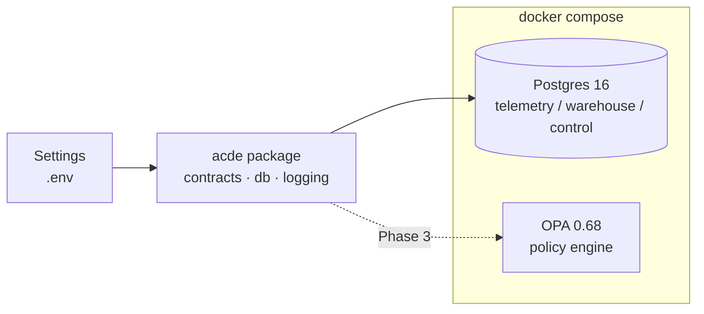

# ACDE — Agentic Cloud Data Engineering

A research-grade, reproducible replication of *"Governing Cloud Data Pipelines with
Agentic AI"* (arXiv:2512.23737): four bounded AI agents (**monitoring**, **optimization**,
**schema**, **recovery**) observe pipeline telemetry, reason via LLM, and **propose**
operational actions that an OPA policy gate validates **before** execution. Agents never
execute anything directly and never generate code. The system is benchmarked against a
static-orchestration baseline with a deterministic failure-injection harness, a seeded
experiment matrix, and a statistical analysis pipeline (paired tests, corrections, effect
sizes, CIs).

## Architecture (Phase 0 slice)



Later phases add Airflow 2.10 + Redpanda (data plane), telemetry collectors, the agent
control loop, the chaos harness, and the experiment runner. See the phase table below.

## Quickstart

Prereqs: [uv](https://docs.astral.sh/uv/), Docker Desktop (Compose v2), GNU make.

```bash
cp .env.example .env        # defaults work for local dev; add ANTHROPIC_API_KEY for live runs
uv sync                     # create venv from committed uv.lock
make up                     # postgres + OPA, waits for healthchecks
make test-unit              # 54 tests, MOCK_LLM=1, zero API calls, coverage >= 80%
make test-integration       # smoke: tables exist, DDL idempotent, OPA /health
make down
```

`MOCK_LLM=1` is the default everywhere (tests, CI, local runs). Live LLM runs are always
an explicit opt-in.

## Cost model (disclosed)

The paper does not define its cost model. Ours (see DEVIATIONS.md D-006):

```
cost_units = compute_unit_seconds × 0.05 + storage_gb_hours × 0.01
compute_unit_seconds = Σ over components: (active workers or pool slots in use) × wall seconds
```

## Repository map

Key entry points — full tree in the project spec:

- `src/acde/contracts/` — pydantic contracts (§5.2): `ProposedAction`, `PolicyDecision`, …
- `src/acde/config.py` — every knob, from env/`.env` only
- `infra/postgres/init/` — idempotent DDL: `telemetry`, `warehouse`, `control` schemas
- `infra/opa/policies/` — Rego policies (Phase 3)
- `tests/unit` (no docker) · `tests/integration` (needs `make up`)
- `DEVIATIONS.md` — every assumption vs. the paper (research artifact)

## Phase status

| Phase | Scope | Status |
|---|---|---|
| 0 | Scaffold, contracts, postgres+OPA, CI | ✅ code complete (docker gate pending) |
| 1 | Data plane: Airflow, Redpanda, datasets | ⬜ |
| 2 | Telemetry, cost ledger, freshness | ⬜ |
| 3 | Policy plane (OPA) & executor | ⬜ |
| 4 | Failure-injection harness | ⬜ |
| 5 | Agents & LLM layer | ⬜ |
| 6 | Control-loop orchestrator | ⬜ |
| 7 | Baseline & experiment runner | ⬜ |
| 8 | Analysis, figures, report | ⬜ |
| 9 | Hardening & reproducibility package | ⬜ |

## Reproduction

The full reproduction guide (clone → every figure) lands in Phase 9. Every stochastic
component is seeded (`run_seed = sha256(f"{config}:{scenario}:{replicate}") % 2**32`);
all experiment metrics are reconstructable from the `telemetry` schema and JSON logs.
