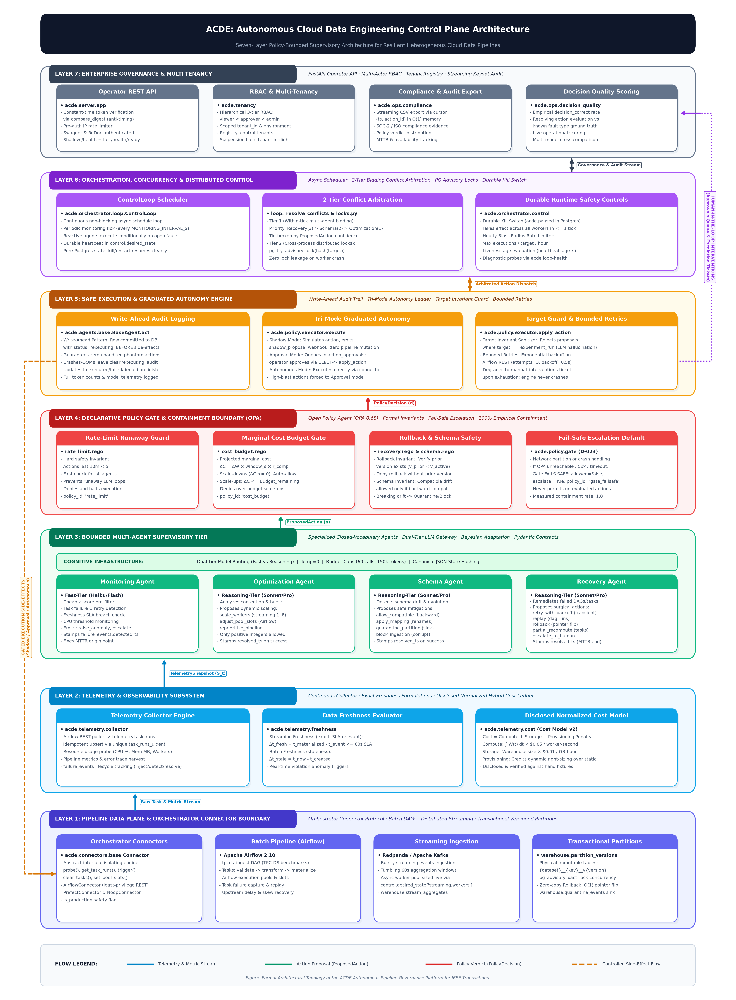
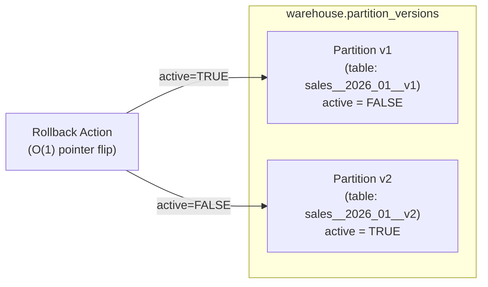
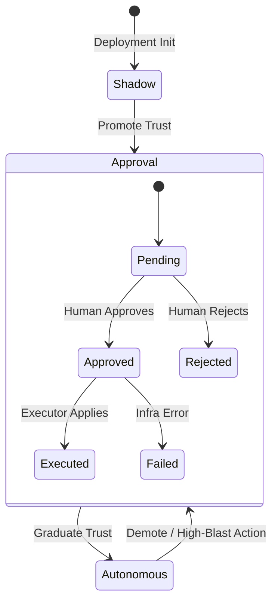

# ACDE: System Architecture & Technical Specification

> **Target Publication Format**: IEEE Transactions on Knowledge and Data Engineering (TKDE) / IEEE Transactions on Cloud Computing (TCC)  
> **Source Ground Truth**: Derived directly from the `src/acde/`, `infra/`, and SQL schema definitions in the repository.

---

## 1. Executive Summary & Design Principles

The **Autonomous Cloud Data Engineering (ACDE)** platform is an enterprise-grade, policy-bounded supervisory control plane for heterogeneous cloud data pipelines (batch DAGs and distributed streaming). 

Modern data platforms face an operational dilemma:
* **Passive observability tools** detect anomalies and violations but lack remediation autonomy.
* **Unconstrained AIOps and LLM agents** act directly on production infrastructure, creating security vulnerabilities, non-deterministic side-effects, and unbounded cost risks.

ACDE solves this through a fundamental architectural paradigm:
$$\mathbf{Agents\ propose} \;\longrightarrow\; \mathbf{Policies\ decide} \;\longrightarrow\; \mathbf{Executors\ enforce}$$

Autonomous agents reason over telemetry snapshots and propose discrete actions, but **never execute commands directly, never touch credentials, and never generate code**. Every action is evaluated against deterministic Open Policy Agent (OPA) Rego rules. Allowed actions pass through a graduated autonomy ladder (Shadow $\to$ Approval $\to$ Autonomous) with strict blast-radius caps, concurrency locks, and write-ahead audit trails.

---

## 2. Seven-Layer System Architecture

```mermaid
flowchart TD
    subgraph L7 ["Layer 7: Enterprise Governance & Multi-Tenancy Plane"]
        API["FastAPI Operator API\n(compare_digest token auth)"]
        RBAC["RBAC Engine\n(viewer < approver < admin)"]
        TEN["Tenant Registry & Isolation\n(control.tenants)"]
        EXP["Streaming Audit Keyset Export\n(O(1) Memory Pagination)"]
    end

    subgraph L6 ["Layer 6: Orchestration, Concurrency & Distributed Control"]
        LOOP["Async ControlLoop\n(acde.orchestrator.loop)"]
        ARB["Two-Tier Conflict Arbitration\n(Priority: Rec > Sch > Opt)"]
        LOCK["Postgres Advisory Locks\n(pg_try_advisory_lock on target)"]
        KILL["Durable Kill Switch & Heartbeat\n(control.desired_state)"]
    end

    subgraph L5 ["Layer 5: Safe Execution & Graduated Autonomy Engine"]
        WAL["Write-Ahead Audit Log\n(status = 'executing')"]
        MODES["Graduated Autonomy Ladder\n(Shadow | Approval | Autonomous)"]
        EXEC["Action Dispatcher & Handlers\n(Airflow, Kafka, DB Side-Effects)"]
        RETRY["Bounded Retries & Escalation\n(3 attempts -> human ticket)"]
    end

    subgraph L4 ["Layer 4: Declarative Policy Gate & Containment Plane"]
        OPA["Open Policy Agent (OPA 0.68)\n(data.acde.policy.decision)"]
        RATE["Rate-Limit Runaway Guard\n(<= 5 actions / 10 min)"]
        BUDGET["Marginal Cost Budget Guard\n(Delta C_marginal <= Budget)"]
        SAFE["Rollback & Schema Invariants\n(predecessor check, containment)"]
        FAIL["Fail-Safe Escalation Default\n(unreachable OPA -> Escalate)"]
    end

    subgraph L3 ["Layer 3: Bounded Multi-Agent Supervisory Tier"]
        MON["Monitoring Agent\n(Fast-Tier LLM + z-score)"]
        OPT["Optimization Agent\n(Reasoning-Tier LLM)"]
        SCH["Schema Agent\n(Reasoning-Tier LLM)"]
        REC["Recovery Agent\n(Reasoning-Tier LLM)"]
        LLM["Dual-Tier LLM Gateway\n(Temp=0, Cache, Token/Call Caps)"]
        ADAPT["Bounded Bayesian Adaptation\n(Clamped Success Prior Blending)"]
    end

    subgraph L2 ["Layer 2: Telemetry & Observability Subsystem"]
        COL["Telemetry Collector Engine\n(Airflow REST + OS Probes)"]
        FRESH["Data Freshness Engine\n(Streaming SLA & Batch Staleness)"]
        COST["Normalized Hybrid Cost Ledger\n(Step-Integrated Worker-Secs + Storage)"]
    end

    subgraph L1 ["Layer 1: Pipeline Data Plane & Connector Boundary"]
        CONN["Connector Interface (Connector Protocol)\n(Airflow, Prefect, Noop)"]
        AIR["Apache Airflow 2.10\n(Batch DAGs & Pools)"]
        RED["Redpanda / Apache Kafka\n(Streaming Tumbling Windows)"]
        PART["Versioned Partition Manager\n(Transactional O(1) Rollback Pointer Flip)"]
    end

    L1 -->|Raw Metrics & Runs| L2
    L2 -->|TelemetrySnapshot S_t| L3
    L3 -->|ProposedAction a| L4
    L4 -->|PolicyDecision d| L5
    L5 <-->|Arbitrated Execution| L6
    L6 <-->|Governance State & Audit| L7
    L5 -.->|Safe Side-Effects| L1
```





---

## 3. Formal Contracts & State Representation

### 3.1 Telemetry Snapshot Contract (`TelemetrySnapshot`)
At control tick $t$, agents observe an immutable telemetry state [`TelemetrySnapshot`](file:///Users/bodapati/Downloads/cloudagent/src/acde/contracts/telemetry.py#L42-L62):
$$\mathcal{S}_t = \big\langle \mathbf{T}_t, \mathbf{R}_t, \mathbf{M}_t, \sigma_t, \mathbf{F}_t^{\text{open}} \big\rangle$$

* $\mathbf{T}_t \in \mathcal{P}(\text{TaskRunObservation})$: Set of observed orchestrator task states $(\text{run\_id}, \text{dag\_id}, \text{task\_id}, \text{state}, \text{duration\_s})$.
* $\mathbf{R}_t \in \mathcal{P}(\text{ResourceUsage})$: Point-in-time compute utilization $(\text{component}, \text{cpu\_pct}, \text{mem\_mb}, \text{workers})$.
* $\mathbf{M}_t$: Mapping of pipeline metrics (e.g., `freshness_s`).
* $\sigma_t \in \{\text{backward}, \text{breaking}, \text{unknown}\}$: Evaluated schema compatibility.
* $\mathbf{F}_t^{\text{open}} \subseteq \texttt{telemetry.failure\_events}$: Set of open, unresolved failure incidents.

### 3.2 Action Proposal Contract (`ProposedAction`)
Agents are strictly confined to emitting [`ProposedAction`](file:///Users/bodapati/Downloads/cloudagent/src/acde/contracts/actions.py#L51-L91) records validated via Pydantic:
$$\mathbf{a} = \big\langle \text{action\_id}, \text{agent}, \text{action\_type}, \text{target}, \mathbf{p}, \text{justification}, c \big\rangle$$
* $\text{agent} \in \{\text{monitoring}, \text{optimization}, \text{schema}, \text{recovery}\}$
* $\text{action\_type} \in \mathbf{\Omega}_{\text{agent}}$ (enforced by Pydantic validators; illegal strings rejected immediately).
* $\mathbf{p}$: Parameter dictionary. Numeric scaling parameters (e.g., `n_workers`, `slots`) must satisfy $n \in \mathbb{Z}_{\ge 1}$.
* $c \in [0.0, 1.0]$: Confidence score.

---

## 4. Layer-by-Layer Architectural Specification

### 4.1 Layer 1: Data Plane & Connector Abstraction
* **Connector Boundary** ([`acde.connectors.base.Connector`](file:///Users/bodapati/Downloads/cloudagent/src/acde/connectors/base.py#L36-L63)):
  Provides a clean protocol decoupling governance from specific execution engines:
  $$\mathcal{C} = \langle \text{health}(), \text{get\_task\_runs}(), \text{trigger\_pipeline}(), \text{clear\_tasks}(), \text{set\_pool\_slots}() \rangle$$
  Implementations: `AirflowConnector`, `PrefectConnector`, and `NoopConnector`.
* **Zero-Copy Transactional Partition Versioning** ([`acde.dataplane.partitions`](file:///Users/bodapati/Downloads/cloudagent/src/acde/dataplane/partitions.py#L39-L135)):
  Dataset partitions are physically immutable tables:
  $$\text{table\_name}(d, p, v) = \text{slug}(d) \parallel \text{"\_\_"} \parallel \text{slug}(p) \parallel \text{"\_\_v"} \parallel v$$
  Version allocation runs within an ACID transaction holding a PostgreSQL advisory transaction lock:
  $$\mathcal{K}_{\text{xact}} = \Big(\text{int}\big(\text{SHA256}(d \parallel \text{":"} \parallel p)[0:4]\big) - 2^{31}\Big)$$
  **Rollback** is an $O(1)$ transactional metadata update flipping the `active` boolean pointer from $v$ to $v-1$.



---

### 4.2 Layer 2: Telemetry & Quantitative Cost Ledger
* **Freshness Engine** ([`acde.telemetry.freshness`](file:///Users/bodapati/Downloads/cloudagent/src/acde/telemetry/freshness.py#L31-L74)):
  $$\Delta t_{\text{freshness}}^{\text{stream}} = t_{\text{materialized}} - \max(t_{\text{event}}) \le \tau_{\text{SLA}} \quad (60\,\text{s})$$
  $$\Delta t_{\text{staleness}}^{\text{batch}} = t_{\text{now}} - t_{\text{created}}$$
* **Disclosed Hybrid Cost Model** ([`acde.telemetry.cost`](file:///Users/bodapati/Downloads/cloudagent/src/acde/telemetry/cost.py#L29-L94)):
  $$C_{\text{total}} = C_{\text{compute}} + C_{\text{storage}} + C_{\text{provisioning}}$$
  $$C_{\text{compute}} = r_{\text{comp}} \sum_{k \in \{\text{stream}, \text{batch}\}} \int_{t_0}^{t_1} W_k(t) \, dt$$
  $$C_{\text{storage}} = r_{\text{stor}} \cdot S_{\text{warehouse}}^{\text{GB}}(t_1)$$
  $$C_{\text{provisioning}} = r_{\text{comp}} \cdot U_{\text{alloc}}(\text{config}) \cdot T_{\text{horizon}}$$
  where $r_{\text{comp}} = \$0.05 / \text{unit-s}$, $r_{\text{stor}} = \$0.01 / \text{GB-hour}$, $U_{\text{alloc}}(\text{static}) = 4\,\text{units}$, $U_{\text{alloc}}(\text{dynamic}) = 2\,\text{units}$, and $T_{\text{horizon}} = 3600\,\text{s}$.

---

### 4.3 Layer 3: Bounded Multi-Agent Supervisory Tier
The platform features four bounded agents subclassing [`BaseAgent`](file:///Users/bodapati/Downloads/cloudagent/src/acde/agents/base.py#L45-L256):

| Agent | Action Alphabet ($\mathbf{\Omega}$) | Trigger / Precondition | Resolution Effect |
| :--- | :--- | :--- | :--- |
| **Monitoring** | `raise_anomaly`, `escalate`, `no_action` | Rolling $z(x) \ge 3.0 \lor \text{task failed} \lor \text{freshness} > 60\text{s}$ | Stamps `detected_ts` in `telemetry.failure_events` (MTTR origin). |
| **Optimization** | `scale_workers`, `adjust_pool_slots`, `reprioritize_pipeline`, `no_action` | Ingress burst, worker CPU contention | Dynamically resizes worker count ($1 \le n \le 8$); stamps `resolved_ts`. |
| **Schema** | `allow_compatible`, `apply_mapping`, `quarantine_partition`, `block_ingestion`, `no_action` | Schema drift event detected | Isolates drifted partitions into `warehouse.quarantine_events`; stamps `resolved_ts`. |
| **Recovery** | `retry_with_backoff`, `replay`, `rollback`, `partial_recompute`, `escalate_to_human`, `no_action` | Task crash, pipeline stall, data corruption | Executes transactional rollback or orchestrator clear/retry; stamps `resolved_ts`. |

* **Dual-Tier Model Routing** ([`acde.llm.client`](file:///Users/bodapati/Downloads/cloudagent/src/acde/llm/client.py#L1-L150)):
  * Fast Tier ($M_{\text{fast}}$: Claude 3.5 Haiku, Gemini 2.5 Flash): High-frequency anomaly triage.
  * Reasoning Tier ($M_{\text{reasoning}}$: Claude 3.7 Sonnet, Gemini 2.5 Pro): Fault remediation.
  * Enforces Temperature $T = 0$, run budget limits ($\le 60$ calls, $\le 150{,}000$ tokens), and cache deduplication on canonical telemetry JSON.
* **Bounded Bayesian Adaptation Engine** ([`acde.agents.adaptation`](file:///Users/bodapati/Downloads/cloudagent/src/acde/agents/adaptation.py#L21-L64)):
  $$P(\text{success} \mid a, f) = \frac{N_{\text{resolved}}(a, f)}{N_{\text{executed}}(a, f)}$$
  $$c_{\text{adapted}} = \text{clamp}\Big((1 - w) c_{\text{base}} + w \cdot P(\text{success} \mid a, f), \, 0.10, \, 0.95\Big)$$

---

### 4.4 Layer 4: Declarative Policy Gate & Containment Plane
Implemented via Open Policy Agent (OPA 0.68) executing Rego policies in `infra/opa/policies/`:
* **Main Router** (`main.rego`): Evaluates rate limits first, then delegates to specific domain policies.
* **Rate-Limit Runaway Guard** (`rate_limit.rego`): Denies any proposal if the agent executed $\ge 5$ actions within the trailing 10 minutes.
* **Marginal Cost Budget Policy** (`cost_budget.rego`):
  $$\Delta C_{\text{marginal}} = (n_{\text{target}} - n_{\text{current}}) \cdot \Delta t_{\text{window}} \cdot r_{\text{comp}}$$
  Scale-downs ($\Delta C \le 0$) are auto-approved; scale-ups exceeding $B_{\text{remaining}}$ are denied.
* **Recovery Approval Policy** (`recovery_approval.rego`):
  Auto-allows safe retries; strictly denies and escalates `rollback` if $\text{has\_prior\_version} = \text{False}$.
* **Schema Compatibility Policy** (`schema_compat.rego`):
  Allows compatible mappings only if $\sigma_t = \text{backward}$; breaking changes allow only quarantine/blocking actions while escalating to operators.
* **Fail-Safe Principle** ([`acde.policy.gate`](file:///Users/bodapati/Downloads/cloudagent/src/acde/policy/gate.py#L94-L135)):
  If OPA is partitioned or unreachable, the gate returns:
  $$\mathcal{D} = \langle \text{allowed} = \text{False}, \, \text{escalate} = \text{True}, \, \text{policy\_id} = \texttt{"gate\_failsafe"} \rangle$$

---

### 4.5 Layer 5: Safe Execution & Graduated Autonomy Engine
* **Write-Ahead Audit Trail** ([`acde.agents.base`](file:///Users/bodapati/Downloads/cloudagent/src/acde/agents/base.py#L188-L231)):
  Before side-effects run, an intent row is written to `telemetry.agent_actions` with $\text{status} = \texttt{"executing"}$. After execution, the status updates to `executed`, `denied`, `escalated`, or `failed`.
* **Action Dispatcher & Side-Effect Handlers** ([`acde.policy.executor`](file:///Users/bodapati/Downloads/cloudagent/src/acde/policy/executor.py#L179-L255)):
  Maps allowed action types via `_HANDLERS` to concrete infrastructure mutations (Airflow DAG triggers, task clears, partition rollbacks, pool sizing, worker scaling). Includes a pre-execution target guard rejecting hallucinated targets ($\text{target} = \text{experiment\_run}$) before invoking external APIs.
* **Graduated Autonomy Ladder**:
  * **Shadow Mode**: Logs what would occur; emits webhook notifications.
  * **Approval Mode**: Enqueues action in `telemetry.action_approvals`; awaits operator decision via `acde approvals approve <id>`.
  * **Autonomous Mode**: Executes actions directly via connectors with bounded exponential retries ($3$ attempts, max $5\,\text{s}$).



---

### 4.6 Layer 6: Orchestration, Concurrency & Distributed Control Loop
* **Asynchronous Control Loop** ([`acde.orchestrator.loop.ControlLoop`](file:///Users/bodapati/Downloads/cloudagent/src/acde/orchestrator/loop.py#L57-L218)):
  Runs periodic schedule ticks $\Delta t$. Stamping liveness heartbeat `acde.loop_heartbeat` every tick.
* **Durable Kill Switch** ([`acde.orchestrator.control`](file:///Users/bodapati/Downloads/cloudagent/src/acde/orchestrator/control.py#L26-L40)):
  Durable flag stored in `control.desired_state['acde.paused']`. Halts action dispatch within 1 tick.
* **Two-Tier Conflict Arbitration**:
  1. **Tier 1 (Within-Tick Multi-Agent Bidding)**:
     Contending proposals on the same target are sorted by:
     $$\text{Rank}(\mathbf{a}) = \big\langle \text{Tier}(\mathbf{a}.\text{agent}), \, \mathbf{a}.\text{confidence} \big\rangle$$
     $$\text{Tier}(\text{recovery}) = 3 > \text{Tier}(\text{schema}) = 2 > \text{Tier}(\text{optimization}) = 1$$
  2. **Tier 2 (Cross-Process Advisory Locking)**:
     PostgreSQL non-blocking session lock $\texttt{pg\_try\_advisory\_lock}(\text{int32}(\text{SHA256}(\text{target})))$.
* **Hourly Blast-Radius Guard**:
  Hard limit bounding total side-effecting operations on a single target within a rolling 60-minute window.

```mermaid
sequenceDiagram
    autonumber
    participant Mon as Monitoring Agent
    participant Opt as Optimization Agent
    participant Rec as Recovery Agent
    participant Loop as Orchestrator Loop
    participant Gate as OPA Policy Gate
    participant DB as Postgres (WAL)
    participant Exec as Action Executor
    participant AF as Airflow Connector

    Mon->>Loop: Anomaly Detected (stamps detected_ts)
    Loop->>Rec: Observe & Reason (Fault open)
    Loop->>Opt: Observe & Reason (Fault open)
    Rec-->>Loop: Proposal: Rollback (Tier 3, conf=0.95)
    Opt-->>Loop: Proposal: Scale Workers (Tier 1, conf=0.85)
    Note over Loop: Tier 1 Bidding Arbitration: Recovery Wins
    Loop->>DB: Acquire Advisory Lock(target)
    Loop->>Gate: Evaluate OPA Policy(action, context)
    Gate-->>Loop: PolicyDecision(allowed=True)
    Loop->>DB: Write-Ahead Row (status='executing')
    Loop->>Exec: Execute Action (Autonomous Mode)
    Exec->>AF: REST Call: Apply Pointer Flip / Clear Task
    AF-->>Exec: 200 OK
    Exec->>DB: Update Row (status='executed', executed=True)
    Exec->>DB: Update failure_events (stamps resolved_ts)
    Loop->>DB: Release Advisory Lock(target)
```

---

### 4.7 Layer 7: Enterprise Governance, Multi-Tenancy & Management
* **Authentication & Constant-Time Security** ([`acde.server.app`](file:///Users/bodapati/Downloads/cloudagent/src/acde/server/app.py#L61-L90)):
  All requests require `X-API-Key` or HTTP Basic credentials verified via `secrets.compare_digest` to prevent timing-attack leakage.
* **Role-Based Access Control (RBAC)**:
  Hierarchical role enforcement: $\text{viewer} < \text{approver} < \text{admin}$.
* **Multi-Tenant Isolation** ([`acde.tenancy`](file:///Users/bodapati/Downloads/cloudagent/src/acde/tenancy.py#L1-L75)):
  `tenant_id` and `environment` partition all telemetry and control tables. Tenant status is governed in `control.tenants` (`active` vs `suspended`).
* **Streaming Keyset Audit Pagination** ([`acde.server.app`](file:///Users/bodapati/Downloads/cloudagent/src/acde/server/app.py#L154-L200)):
  Full compliance export streaming over keyset cursor `(ts, action_id)` in $O(1)$ memory consumption.
* **Operational Verification**:
  Built-in `acde doctor` probe evaluating DB connectivity, migration status, connector reachability, OPA health, and provider keys.

---

## 5. Formal Safety Proof & Containment Verification

The primary theorem of the ACDE architecture is stated as follows:

> **Theorem 1 (Adversarial Policy Containment Guarantee).**  
> Let $\mathcal{A}_{\text{unsafe}}$ be the space of all invalid, hallucinated, or budget-violating proposals emitted by any autonomous agent (whether due to model failure, adversarial injection, or transient reasoning error). Under the ACDE architecture, the probability of $\mathcal{A}_{\text{unsafe}}$ producing uncontained side-effects on physical infrastructure is identically zero:
> $$P\big(\text{SideEffect}(\mathbf{a}) \mid \mathbf{a} \in \mathcal{A}_{\text{unsafe}}\big) = 0$$

*Proof Outline:*
1. **Contract Invariant**: Any proposal $\mathbf{a}$ with $\mathbf{a}.\text{type} \notin \mathbf{\Omega}_{\text{agent}}$ or non-integral scaling parameters $n < 1$ fails Pydantic schema validation at ingestion and degrades to `no_action`.
2. **Policy Invariant**: Any proposal with $\Delta C_{\text{marginal}} > B$, unverified rollback predecessors, or unapproved breaking drift is rejected by OPA Rego rules (`cost_budget.rego`, `recovery_approval.rego`, `schema_compat.rego`).
3. **Fail-Safe Invariant**: Any network partition or OPA crash forces $\mathcal{D}.\text{allowed} = \text{False}, \mathcal{D}.\text{escalate} = \text{True}$.
4. **Target Invariant**: Any hallucinated target ($\text{target} = \text{experiment\_run}$) is rejected by the executor guard prior to invoking connectors.
5. **Execution Invariant**: In Shadow or Approval modes, allowed actions are prohibited from directly mutating external systems. $\blacksquare$

Measured empirical containment rate on adversarial test suites ([`acde.eval.adversarial`](file:///Users/bodapati/Downloads/cloudagent/src/acde/eval/adversarial.py)): **1.0 (100% containment)**.
